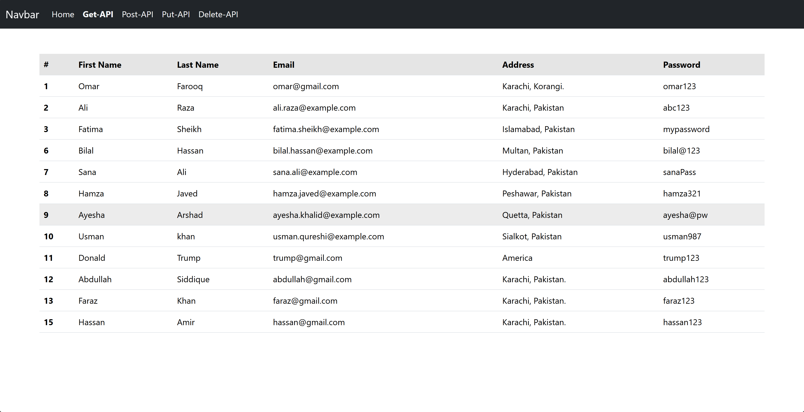
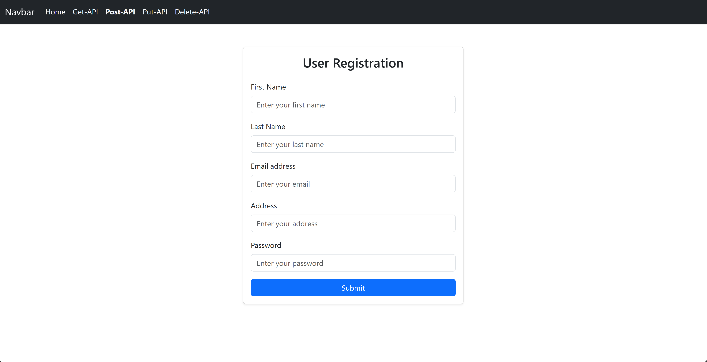
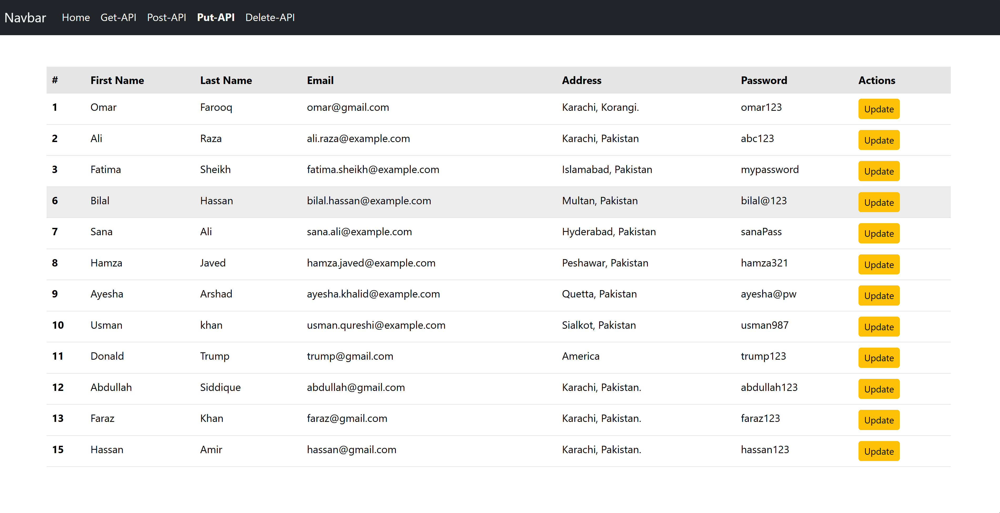
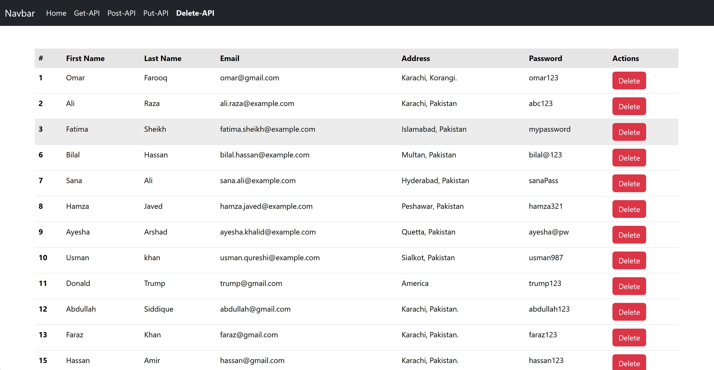

# 🧩 Angular 19 + Laravel 8 CRUD API Project:-

This is a simple **Full-Stack CRUD Application** built using **Angular 19** (frontend) and **Laravel 8** (backend APIs).  
It demonstrates how to perform **Create, Read, Update, and Delete (CRUD)** operations through RESTful APIs.

---

## 🚀 Features-

✅ Create a new user  
✅ Display all users  
✅ Update existing user details  
✅ Delete a user  
✅ API integration between Angular & Laravel  
✅ Clean and beginner-friendly code

---

## 🛠️ Tech Stack:-

| Layer | Technology |
|--------|-------------|
| Frontend | Angular 19, Bootstrap 5 |
| Backend | Laravel 8 (PHP Framework) |
| Database | MySQL |
| API Format | REST (JSON) |

---

## 🧠 How It Works?

The Angular frontend sends HTTP requests using HttpClientModule.

The Laravel backend handles routes defined in routes/api.php.

Responses are returned in JSON format and displayed in Angular components.

## 📸 Screenshots:-

## 👨‍💻 Author:-

Omar Farooq.

💼 Full-Stack Developer.

🔗 LinkedIn Profile:
https://linkedin.com/in/omar-farooq-534831341

🌐 GitHub Profile:
https://github.com/mohammadomarf37

## ⭐ Contribution:-

If you found this project helpful,
feel free to star the repo ⭐ and share it on LinkedIn to help others learn!